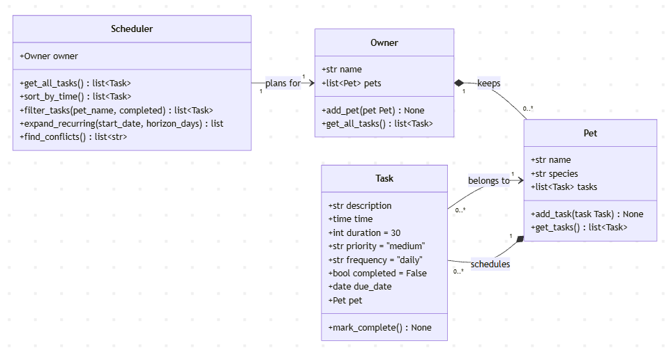

# PawPal+ (Module 2 Project)

You are building **PawPal+**, a Streamlit app that helps a pet owner plan care tasks for their pet.

## Scenario

A busy pet owner needs help staying consistent with pet care. They want an assistant that can:

- Track pet care tasks (walks, feeding, meds, enrichment, grooming, etc.)
- Consider constraints (time available, priority, owner preferences)
- Produce a daily plan and explain why it chose that plan

Your job is to design the system first (UML), then implement the logic in Python, then connect it to the Streamlit UI.

## What you will build

Your final app should:

- Let a user enter basic owner + pet info
- Let a user add/edit tasks (duration + priority at minimum)
- Generate a daily schedule/plan based on constraints and priorities
- Display the plan clearly (and ideally explain the reasoning)
- Include tests for the most important scheduling behaviors

## ✨ Features

PawPal+ layers real scheduling algorithms on top of a simple `Owner → Pet → Task` model:

- **Time-ordered planning** — `Scheduler.sort_by_time()` merges tasks from every pet and orders them by due date, then clock time, so the whole household's day reads top-to-bottom.
- **Filtering by pet and status** — `Scheduler.filter_tasks()` narrows the view to a single pet, to pending vs. completed tasks, or any combination.
- **Conflict warnings with severity** — `Scheduler.find_conflicts()` detects overlapping time windows and classifies them: a **same-pet** overlap is a hard conflict (one pet can't be in two places), while a **cross-pet** overlap is an owner double-booking.
- **Recurring tasks** — `Scheduler.expand_recurring()` projects `daily`, `weekly`, and `once` tasks across a date horizon, and `Task.mark_complete()` auto-enqueues the next occurrence when a recurring task is finished.
- **Interactive Streamlit UI** — add an owner, pets, and tasks; filter the plan; and generate a schedule with color-coded conflict callouts (🔴 impossible for one pet, 🟡 you're double-booked, ✅ all clear).

## 🏗️ System Architecture

The final class model — `Owner` composes `Pet`s, each `Pet` composes its `Task`s (with a
back-reference), and the `Scheduler` plans over one `Owner`'s full task set:



The Mermaid source lives at [`diagrams/uml_final.mmd`](diagrams/uml_final.mmd).

## Getting started

### Setup

```bash
python -m venv .venv
source .venv/bin/activate  # Windows: .venv\Scripts\activate
pip install -r requirements.txt
```

### Suggested workflow

1. Read the scenario carefully and identify requirements and edge cases.
2. Draft a UML diagram (classes, attributes, methods, relationships).
3. Convert UML into Python class stubs (no logic yet).
4. Implement scheduling logic in small increments.
5. Add tests to verify key behaviors.
6. Connect your logic to the Streamlit UI in `app.py`.
7. Refine UML so it matches what you actually built.

## 🖥️ Sample Output

### A sample of the app's CLI:

Running `python main.py` merges both pets' tasks into one time-ordered plan (a fuller
run, including conflicts and recurrence, is in the [Demo Walkthrough](#-demo-walkthrough) below):

```
All tasks for Alex, sorted by time:
  07:30 — Feed (10 min) [priority: high]
  08:00 — Morning walk (30 min) [priority: high]
  08:15 — Fetch training (20 min) [priority: medium]
  12:30 — Midday brush (15 min) [priority: low]
  14:00 — Vet visit (60 min) [priority: high] (done)
  14:30 — Grooming (45 min) [priority: medium]
  18:00 — Evening walk (30 min) [priority: medium]
```

## 🧪 Testing PawPal+

Run the full test suite from the project root:

```bash
python -m pytest
```

The tests live in `tests/test_pawpal.py` and cover the core scheduling behaviors:

- **Task completion** — `mark_complete()` flips a task's `completed` status, and re-completing an already-done task is a no-op (no duplicate reschedule).
- **Sorting correctness** — `sort_by_time()` orders tasks by due date then time (so tomorrow at 06:00 sorts after today at 18:00), is stable for identical times, and returns an empty list when there are no tasks.
- **Recurrence logic** — completing a `daily` task spawns a new instance due the next day, `weekly` advances by seven days, and `once` never reschedules; `expand_recurring()` emits independent per-day copies that don't alias each other.
- **Conflict detection** — `find_conflicts()` flags overlapping time windows, ignores back-to-back tasks and tasks on different days, and distinguishes same-pet clashes from cross-pet owner double-bookings.
- **Filtering behavior** — `filter_tasks()` filters by pet name, by completion status (including the `completed=False` case), and returns an empty list for an unknown pet.

Terminal output of a successful test run:

```
============================= test session starts =============================
platform win32 -- Python 3.13.13, pytest-9.1.1, pluggy-1.6.0
rootdir: D:\ai110-module2show-pawpal
collected 18 items

tests\test_pawpal.py ..................                                  [100%]

============================= 18 passed in 0.02s ==============================
```

## 📐 Smarter Scheduling

PawPal+ adds four algorithmic layers on top of the basic Owner/Pet/Task model. Each one is implemented as a method on the `Scheduler` class in `pawpal_system.py`, plus one small extension to `Task.mark_complete` that auto-reschedules recurring tasks.

| Feature                    | Method(s)                                                                       | Notes                                                                                                                                                                                                          |
| -------------------------- | ------------------------------------------------------------------------------- | -------------------------------------------------------------------------------------------------------------------------------------------------------------------------------------------------------------- |
| Sorting by time            | `Scheduler.sort_by_time()`                                                      | Sorts every task across all pets in chronological order using a lambda key on `task.time`.                                                                                                                     |
| Filtering by pet or status | `Scheduler.filter_tasks(pet_name=None, completed=None)`                         | Filters by pet name, completion status, or both. No arguments returns everything.                                                                                                                              |
| Conflict detection         | `Scheduler.find_conflicts()`                                                    | Detects overlapping time windows and distinguishes same-pet clashes from owner double-bookings. Returns warning strings; never raises.                                                                         |
| Recurring tasks            | `Scheduler.expand_recurring(start_date, horizon_days)` + `Task.mark_complete()` | `expand_recurring` emits `(date, task)` pairs across a date window based on frequency (`daily`, `weekly`, `once`). `mark_complete` auto-adds the next instance via `timedelta` when a recurring task finishes. |

Run `python main.py` to see all four features exercised against a demo owner with two pets.

## 📸 Demo Walkthrough

### What the UI lets you do

The Streamlit app (`streamlit run app.py`) has three working areas:

- **Owner & pet setup** — enter an owner name, then add one or more pets (name + species).
- **Task entry** — for a chosen pet, pick a task from a list of common care activities (or choose **Custom…** to type your own), then set time, duration, and priority. Added tasks appear immediately in a per-pet table.
- **Build Schedule** — filter by pet (or "All pets") and by status (All / Pending / Completed), then generate a single time-ordered plan with conflict warnings. Each row has an interactive **Done** checkbox: ticking it marks that task complete on the pet and persists across the session.

### Example workflow

1. Set the owner to **Jordan** and add a pet, **Mochi** (dog).
2. Add a task: *Morning walk*, 08:00, 20 min, high priority.
3. Add a second task: *Vet visit*, 08:10, 30 min, high priority — deliberately overlapping.
4. Under **Build Schedule**, leave the filters on "All pets" / "All" and click **Generate schedule**.
5. PawPal+ shows the two tasks ordered by time **and** a 🔴 warning that Mochi is booked twice at once — because one pet can't do both. Remove or move one task and the warning turns into a ✅ "clear to go" banner.

### Key Scheduler behaviors on display

- **Sorting** — tasks entered out of order (evening before morning) are reordered earliest-first via `sort_by_time()`.
- **Filtering** — choosing a single pet or "Pending" only re-runs `filter_tasks()` before sorting.
- **Conflict warnings** — same-pet overlaps render as `st.error` (🔴 impossible), cross-pet overlaps as `st.warning` (🟡 double-booked), and a clean plan as `st.success` (✅).
- **Recurrence** — completing a `daily`/`weekly` task auto-schedules its next occurrence via `Task.mark_complete()`.

### Sample CLI output

The same logic runs headless. `python main.py` builds a demo owner (**Alex**) with two pets and exercises every Scheduler feature:

```
All tasks for Alex, sorted by time:
  07:30 — Feed (10 min) [priority: high]
  08:00 — Morning walk (30 min) [priority: high]
  08:15 — Fetch training (20 min) [priority: medium]
  12:30 — Midday brush (15 min) [priority: low]
  14:00 — Vet visit (60 min) [priority: high] (done)
  14:30 — Grooming (45 min) [priority: medium]
  18:00 — Evening walk (30 min) [priority: medium]

Only Rex's tasks:
  18:00 — Evening walk (30 min) [priority: medium]
  08:00 — Morning walk (30 min) [priority: high]
  12:30 — Midday brush (15 min) [priority: low]
  14:30 — Grooming (45 min) [priority: medium]
  08:15 — Fetch training (20 min) [priority: medium]

Pending tasks only:
  18:00 — Evening walk (30 min) [priority: medium]
  08:00 — Morning walk (30 min) [priority: high]
  12:30 — Midday brush (15 min) [priority: low]
  14:30 — Grooming (45 min) [priority: medium]
  08:15 — Fetch training (20 min) [priority: medium]
  07:30 — Feed (10 min) [priority: high]

3-day plan starting today:
  2026-07-04 18:00 — Evening walk (daily)
  2026-07-04 08:00 — Morning walk (daily)
  ... (daily tasks repeat for 2026-07-05 and 2026-07-06) ...
  2026-07-04 14:00 — Vet visit (once)

Scheduling conflicts:
  WARNING: Rex has overlapping tasks — Morning walk at 08:00 and Fetch training at 08:15.
  WARNING: owner double-booked — Milo's Vet visit at 14:00 overlaps with Rex's Grooming at 14:30.

Rex's tasks after completing Morning walk (new instance should appear for tomorrow):
  2026-07-04 08:00 — Morning walk [done]
  ... (Rex's other tasks unchanged) ...
  2026-07-05 08:00 — Morning walk [pending]
```

> The two `WARNING` lines show both conflict types: a **same-pet** clash (Rex booked twice)
> and a **cross-pet** owner double-booking (Milo's vet visit vs. Rex's grooming). The final
> block shows recurrence — completing the 08:00 walk auto-creates tomorrow's instance.
